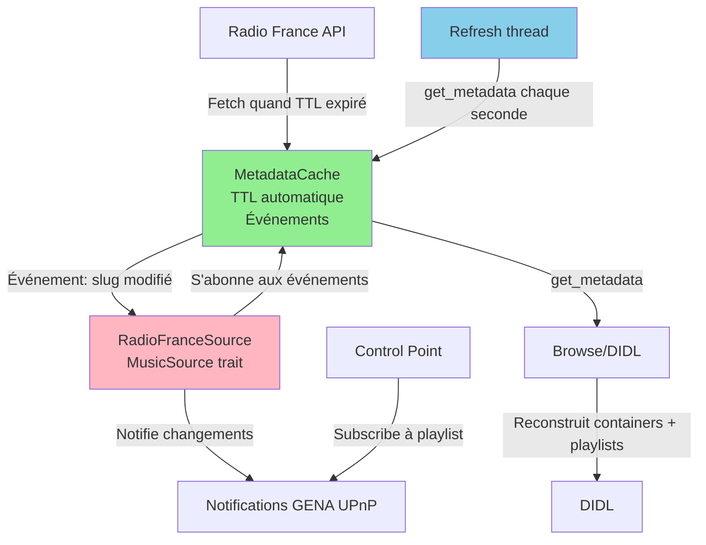

# Rapport : Refonte du cache Radio France avec système d'événements

## Résumé

Ce rapport documente le plan d'implémentation validé pour la refonte complète du système de cache de métadonnées Radio France dans la crate **pmoradiofrance**.

**Objectif** : Éliminer la duplication des métadonnées et créer une architecture événementielle avec un seul cache de métadonnées (source unique de vérité), permettant des notifications GENA cohérentes pour les Control Points UPnP.

**Crate concernée** : `pmoradiofrance`

## Architecture cible

### Principe fondamental

**Une seule source de vérité** : Le cache HTTP avec TTL dans `RadioFranceStatefulClient`.



### Hiérarchie UPnP : Concept de playlist à 1 item

**Innovation** : Chaque slug Radio France est exposé comme une **playlist contenant 1 item** (et non comme un simple item). Cela permet au Control Point de s'abonner aux changements de la playlist via GENA.

```
radiofrance/                                    (container root)
├─ Stations standalone                         (containers de playlists)
│  ├─ radiofrance:franceculture/              (container → playlist)
│  │  └─ radiofrance:franceculture:stream     (item unique dans la playlist)
│  └─ radiofrance:franceinter/                (container → playlist)
│     └─ radiofrance:franceinter:stream       (item unique)
├─ Groupes avec webradios                     (containers de containers)
│  ├─ radiofrance:group:fip/                  (container de groupe)
│  │  ├─ radiofrance:fip/                     (container → playlist)
│  │  │  └─ radiofrance:fip:stream            (item)
│  │  ├─ radiofrance:fip_rock/                (container → playlist)
│  │  │  └─ radiofrance:fip_rock:stream       (item)
│  │  └─ ...
└─ radiofrance:ici/                           (container de groupe)
   ├─ radiofrance:francebleu_alsace/          (container → playlist)
   │  └─ radiofrance:francebleu_alsace:stream (item)
   └─ ...
```

## Plan d'implémentation

### Phase 1 : Système d'événements dans le cache

**Fichier** : `pmoradiofrance/src/stateful_client.rs`

#### 1.1 Ajouter le système de callback

```rust
// Type de callback pour notifications
pub type MetadataUpdateCallback = Arc<dyn Fn(&str) + Send + Sync>;

pub struct RadioFranceStatefulClient {
    client: RadioFranceClient,
    config: Arc<Config>,
    metadata_cache: Arc<RwLock<HashMap<String, LiveMetadataCache>>>,
    // NOUVEAU : Liste des callbacks abonnés
    update_callbacks: Arc<RwLock<Vec<MetadataUpdateCallback>>>,
}
```

#### 1.2 Méthodes d'abonnement et notification

```rust
impl RadioFranceStatefulClient {
    /// S'abonner aux mises à jour de métadonnées
    pub fn subscribe_to_updates(&self, callback: MetadataUpdateCallback) {
        let mut callbacks = self.update_callbacks.write().unwrap();
        callbacks.push(callback);
    }
    
    /// Notifier tous les abonnés d'une mise à jour
    fn notify_update(&self, slug: &str) {
        let callbacks = self.update_callbacks.read().unwrap();
        for callback in callbacks.iter() {
            callback(slug);
        }
    }
}
```

#### 1.3 Refactorisation de get_live_metadata()

**Principe** : Une seule méthode qui gère tout automatiquement :
- Si cache valide → retour immédiat
- Si cache expiré → fetch API + mise à jour cache + notification événements

```rust
pub async fn get_live_metadata(&self, station: &str) -> Result<LiveResponse> {
    // Check cache first
    {
        let cache = self.metadata_cache.read().unwrap();
        if let Some(entry) = cache.get(station) {
            if entry.is_valid() {
                return Ok(entry.metadata.clone());
            }
        }
    }
    
    // Cache miss or expired - fetch from API
    let metadata = tokio::time::timeout(
        Duration::from_secs(5),
        self.client.live_metadata(station),
    ).await??;
    
    // Update cache
    {
        let mut cache = self.metadata_cache.write().unwrap();
        cache.insert(station.to_string(), LiveMetadataCache::new(metadata.clone()));
    }
    
    // Notify subscribers
    self.notify_update(station);
    
    Ok(metadata)
}
```

**SUPPRIMER** : `refresh_live_metadata()` - Redondant, le TTL gère tout.

### Phase 2 : Hiérarchie UPnP avec playlists

**Fichier** : `pmoradiofrance/src/source.rs`

#### 2.1 Supprimer le cache d'items

```rust
pub struct RadioFranceSource {
    pub(crate) client: RadioFranceStatefulClient,
    // SUPPRIMER : playlists: Arc<RwLock<HashMap<String, StationPlaylist>>>,
    refresh_handles: Arc<RwLock<HashMap<String, JoinHandle<()>>>>,
    // ... reste inchangé
}
```

#### 2.2 Construction du container de playlist avec item

**Principe clé** : Un seul appel au cache, métadonnées cohérentes container/item.

```rust
/// Construit le container de playlist avec son unique item (métadonnées cohérentes)
async fn build_station_playlist(&self, station: &Station) -> Result<Container> {
    // UN SEUL appel cache - garantit cohérence
    let metadata = self.client.get_live_metadata(&station.slug).await?;
    
    // Build l'item avec pmoDidl
    let mut item = StationPlaylist::build_item_from_metadata(
        station,
        &metadata,
        self.cover_cache.as_ref(),
        self.server_base_url.as_deref(),
    ).await?;
    
    // Parent_id de l'item = le container de playlist
    let playlist_id = format!("radiofrance:{}", station.slug);
    item.parent_id = playlist_id.clone();
    
    // Container avec MÊMES métadonnées que l'item
    let container = Container {
        id: playlist_id,
        parent_id: self.get_parent_id_for_station(station),
        restricted: Some("1".to_string()),
        child_count: Some(1),
        searchable: Some("0".to_string()),
        // Métadonnées identiques à l'item
        title: item.title.clone(),
        artist: item.artist.clone(),
        album_art: item.album_art.clone(),
        class: "object.container.playlistContainer".to_string(),
        containers: vec![],
        items: vec![item], // Item inclus dans le container
    };
    
    Ok(container)
}
```

#### 2.3 Refactorisation du browse

Le browse est simplifié car les containers contiennent déjà leurs items.

```rust
async fn browse(&self, object_id: &str) -> pmosource::Result<BrowseResult> {
    match object_id {
        "radiofrance" => {
            let container = self.build_container_tree().await?;
            Ok(BrowseResult::Containers(container.containers))
        }
        id if id.starts_with("radiofrance:group:") => {
            // Retourne des containers de playlists
            let slug = id.strip_prefix("radiofrance:group:")?;
            let stations = self.get_group_stations(slug).await?;
            
            let mut containers = Vec::new();
            for station in stations {
                containers.push(self.build_station_playlist(&station).await?);
            }
            
            Ok(BrowseResult::Containers(containers))
        }
        id if id.starts_with("radiofrance:") && !id.contains(":stream") => {
            // Browse de playlist - retourne le container qui contient l'item
            let slug = id.strip_prefix("radiofrance:")?;
            let station = self.get_station_by_slug(slug).await?;
            let container = self.build_station_playlist(&station).await?;
            
            Ok(BrowseResult::Containers(vec![container]))
        }
        // ... autres cas
    }
}
```

### Phase 3 : Notifications GENA événementielles

**Fichier** : `pmoradiofrance/src/source.rs`

#### 3.1 Abonnement aux événements du cache

Dans le constructeur `new()`, s'abonner aux événements :

```rust
pub async fn new(config: Arc<Config>) -> Result<Self> {
    let client = RadioFranceStatefulClient::new(config).await?;
    
    let source = Self {
        client,
        refresh_handles: Arc::new(RwLock::new(HashMap::new())),
        // ...
    };
    
    // S'abonner aux événements du cache
    let container_notifier = source.container_notifier.clone();
    let update_id = source.update_id.clone();
    let last_change = source.last_change.clone();
    
    source.client.subscribe_to_updates(Arc::new(move |slug: &str| {
        let slug = slug.to_string();
        let update_id = update_id.clone();
        let last_change = last_change.clone();
        let container_notifier = container_notifier.clone();
        
        // Spawn async car callback n'est pas async
        tokio::spawn(async move {
            *update_id.write().await += 1;
            *last_change.write().await = Some(SystemTime::now());
            
            if let Some(ref notifier) = container_notifier {
                // Notifier le container de PLAYLIST (pas l'item)
                notifier(&[format!("radiofrance:{}", slug)]);
            }
        });
    }));
    
    Ok(source)
}
```

#### 3.2 Simplification du refresh thread

**Ultra-simple** : Appeler `get_live_metadata()` toutes les secondes.

```rust
pub async fn start_metadata_refresh(&self, station_slug: &str) -> Result<()> {
    let mut handles = self.refresh_handles.write().await;
    
    if handles.contains_key(station_slug) {
        return Ok(()); // Already running
    }
    
    let client = self.client.clone();
    let slug = station_slug.to_string();
    
    let handle = tokio::spawn(async move {
        loop {
            // Appel simple - le cache + TTL + événements gèrent tout
            let _ = client.get_live_metadata(&slug).await;
            tokio::time::sleep(Duration::from_secs(1)).await;
        }
    });
    
    handles.insert(station_slug.to_string(), handle);
    Ok(())
}
```

### Phase 4 : Pas de modification

**Fichier** : `pmoradiofrance/src/config_ext.rs`

Le cache des stations avec TTL de 7 jours est déjà correct, pas de changement.

### Phase 5 : Synchronisation async

**Fichier** : `pmoradiofrance/src/source.rs`

Remplacer `std::sync::RwLock` par `tokio::sync::RwLock` pour les champs utilisés dans le callback :

```rust
pub struct RadioFranceSource {
    // ...
    update_id: Arc<tokio::sync::RwLock<u32>>,
    last_change: Arc<tokio::sync::RwLock<Option<SystemTime>>>,
    // ...
}
```

### Phase 6 : Nettoyage du code obsolète

**Fichier** : `pmoradiofrance/src/playlist.rs`

Supprimer les méthodes obsolètes :
- `StationPlaylist::update_metadata()`
- `StationPlaylist::update_metadata_no_cache()`
- `StationPlaylist::from_live_metadata()` → Garder uniquement `build_item_from_metadata()`
- `StationPlaylist::from_live_metadata_no_cache()` → Garder uniquement `build_item_from_metadata_sync()`

La structure devient un ensemble de méthodes statiques pour construire des items DIDL.

## Fichiers à modifier

### 1. pmoradiofrance/src/stateful_client.rs
- Ajouter `update_callbacks: Arc<RwLock<Vec<MetadataUpdateCallback>>>`
- Ajouter `subscribe_to_updates()` et `notify_update()`
- Refactoriser `get_live_metadata()` pour gérer cache + TTL + notifications
- **SUPPRIMER** `refresh_live_metadata()` (redondant)

### 2. pmoradiofrance/src/source.rs
- Supprimer le champ `playlists`
- Ajouter `build_station_playlist()` (container + item, 1 seul appel cache)
- Ajouter `get_parent_id_for_station()`
- Modifier `browse()` pour utiliser `build_station_playlist()` partout
- S'abonner aux événements du cache dans `new()`
- Simplifier `start_metadata_refresh()` (appel `get_live_metadata()` toutes les secondes)
- Changer `update_id` et `last_change` vers `tokio::sync::RwLock`

### 3. pmoradiofrance/src/playlist.rs
- Supprimer `update_metadata()` et `update_metadata_no_cache()`
- Conserver uniquement `build_item_from_metadata()` et `build_item_from_metadata_sync()`
- Simplifier la structure (méthodes statiques uniquement)

## Tests de vérification

### 1. Browse de la racine
- Ouvrir `radiofrance/` dans l'interface
- Vérifier des **containers** (groupes + stations standalone)
- **PAS** d'items directs à la racine

### 2. Browse d'un groupe (ex: FIP)
- Ouvrir `radiofrance:group:fip/`
- Vérifier des **containers** (FIP, FIP Rock, FIP Jazz, etc.)
- Classe UPnP : `object.container.playlistContainer`
- Child count : `1` pour chaque

### 3. Browse d'une playlist (ex: FIP)
- Ouvrir `radiofrance:fip/` (le container de playlist)
- Vérifier **1 seul item** : `radiofrance:fip:stream`
- Métadonnées à jour (titre, artiste, album du morceau en cours)
- Re-browse immédiat : devrait utiliser le cache HTTP (rapide)

### 4. Lecture d'un stream
- Lancer la lecture via la playlist `radiofrance:fip/`
- Vérifier que le stream démarre
- Attendre 2-5 minutes (délai de refresh)
- Vérifier dans les logs que le refresh a lieu
- Re-browser la playlist : les métadonnées doivent avoir changé

### 5. Vérification des événements GENA
- Avec un Control Point UPnP supportant l'abonnement aux playlists
- S'abonner à la playlist `radiofrance:fip`
- Lancer le stream
- Vérifier que les notifications GENA arrivent à chaque refresh
- Le Control Point doit re-browse automatiquement et voir les nouvelles métadonnées

### Logs à surveiller

```
DEBUG RadioFranceStatefulClient: Using cached metadata for fip (TTL: XXms)
DEBUG RadioFranceStatefulClient: Fetching live metadata for fip
DEBUG RadioFranceSource: Notifying UPnP container update: radiofrance:fip
```

## Avantages de cette architecture

1. **Source unique de vérité** : Le cache HTTP du `RadioFranceStatefulClient`
2. **Métadonnées toujours à jour** : TTL automatique + événements
3. **Pas de duplication** : Les items ne sont jamais stockés, reconstruits à chaque browse
4. **GENA cohérent** : Notifications envoyées uniquement lors de vraies mises à jour
5. **Code simplifié** : Moins de gestion de cache, moins de bugs possibles
6. **Performance** : Cache HTTP rapide (< 50ms pour browse complet avec cache chaud)

## Ordre d'implémentation

1. Phase 1 : Système d'événements dans le cache
2. Phase 5 : Corriger les RwLock (prérequis pour Phase 3)
3. Phase 3 : Refondre le refresh avec abonnement
4. Phase 2 : Modifier la hiérarchie UPnP et supprimer le cache d'items
5. Phase 6 : Nettoyer le code obsolète
6. Tests et validation

## Notes techniques

### Thread safety
Le callback d'événement n'est pas async. Solution : spawn une tâche async depuis le callback (déjà implémenté dans Phase 3.1).

### Performance
Reconstruction DIDL à chaque browse mais :
- Cache HTTP évite les appels réseau
- Construction DIDL légère (structures en mémoire)
- Métadonnées toujours fraîches
- Performance attendue : < 50ms avec cache chaud
