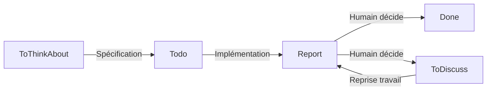

# Règles de développement PMOMusic

## Contexte projet

**PMOMusic** : Système audio HiFi basé sur UPnP/DLNA (LossLess/Bit-Perfect uniquement).

**Technologies** :
- Backend : Rust
- Frontend : Vue.js (TypeScript/JavaScript)

**Composants** : Media Server, Control Point, Media Renderer

**Développement** : Collaboration humain-LLM (Claude/ChatGPT/Ollama)

---

## Règles Rust (Cargo workspace)

### Gestion des dépendances

**⚠️ OBLIGATOIRE** : Les dépendances doivent être ajoutées au niveau **workspace** autant que possible.

1. Ajouter la dépendance dans `Cargo.toml` racine (section `[workspace.dependencies]`)
2. Référencer avec `{ workspace = true }` dans le `Cargo.toml` de la crate

**Exemple** :
```toml
# Cargo.toml (racine workspace)
[workspace.dependencies]
rand = "0.9"

# pmocontrol/Cargo.toml
[dependencies]
rand = { workspace = true }
```

**Exceptions** : Dépendances spécifiques à une seule crate avec version très particulière.

---

## Prérequis des tâches

### Spécification des crates cibles

**⚠️ CRITIQUE** : Le LLM doit **REFUSER** d'exécuter une tâche si la ou les crates concernées ne sont pas explicitement spécifiées dans le fichier `Todo/{nom}.md`.

**Informations requises** :
- Nom de la ou des crates à modifier
- Chemin relatif si nécessaire (ex: `pmocontrol/src/...`)

**En cas d'absence** :
- Le LLM demande clarification à l'humain
- Ne pas deviner ou supposer les crates concernées

---

## Workflow Blackboard

### Structure

```
Blackboard/
├── ToThinkAbout/    # Réflexion, idées, architecture
├── Architecture/    # Documentation d'architecture validée
├── Todo/            # Tâches à réaliser
├── Report/          # Rapports de tâches réalisées
├── ToDiscuss/       # Tâches incomplètes nécessitant discussion
├── Done/            # Tâches terminées (synthèses)
└── Rules.md         # Ce fichier
```

### Cycle de vie d'une tâche



### Règles strictes

#### 1. Phase de réflexion (ToThinkAbout)
- **Collaboration** : Humain et LLM peuvent modifier
- **But** : Explorer idées, définir architecture
- **Sortie** : Documents de spécification → `Todo/`

#### 2. Phase de réalisation (Todo → Report)
- **Input** : Fichier `Todo/{nom}.md`
- **Action** : LLM implémente la tâche
- **Output** : Fichier `Report/{nom}.md` (même nom obligatoire)
- **Contenu du rapport** :
  - Résumé **court** du travail effectué (2-3 phrases maximum)
  - Liste **exhaustive** des fichiers créés/modifiés avec leur chemin complet
  - **INTERDIT** : Rapport détaillé dans la discussion (uniquement dans `Report/`)
  - **INTERDIT** : Explication technique détaillée, code d'exemple, architecture
  
- **Réponse dans la discussion (après implémentation)** :
  - Message **très bref** confirmant la fin de la tâche
  - Référence au fichier `Report/{nom}.md` pour les détails
  - **Format attendu** : "Tâche terminée. Voir `Report/{nom}.md` pour la liste des modifications."
  - **PAS de** : résumé détaillé, explication du code, liste des avantages, etc.

#### 3. Décision humaine (Report → Done ou ToDiscuss)

**⚠️ CRITIQUE** : Seul l'humain décide de la destination. Le LLM ne doit JAMAIS déplacer ou classer une tâche.

**Cas 1 : Tâche complète** → `Done/`
- Humain déplace `Todo/{nom}.md` → `Done/{nom}.md`
- LLM crée une synthèse (tâche originale + rapport)
- Contenu final dans `Done/{nom}.md`

**Cas 2 : Tâche incomplète** → `ToDiscuss/`
- Humain déplace `Todo/{nom}.md` → `ToDiscuss/{nom}.md`
- Humain ajoute annotations/remarques dans `ToDiscuss/{nom}.md`
- Lors de la reprise :
  - LLM lit les annotations
  - Complète `Report/{nom}.md` avec les modifications
  - Nouveau cycle de validation

#### 4. Documentation architecture (Architecture/)
- Contient les documents d'architecture validés et stables
- Référence pour patterns de code (ex: `pmoconfig_ext.md`, `pmoserver_ext.md`)
- Ne pas modifier sans validation explicite

---

## Versioning (Jujutsu)

**Système** : [Jujutsu (jj)](https://github.com/jj-vcs/jj)  
**Repository** : `https://gargoton.petite-maison-orange.fr/eric/pmomusic.git`

### Commandes Makefile

| Commande | Action | Description |
|----------|--------|-------------|
| `make jjnew` | Nouveau commit | Documente le commit actuel (`jj auto-describe`) puis `jj new` |
| `make jjpush` | Push vers Git | Documente le commit puis `jj git push --change @`<br/>→ Crée branche + PR sur le serveur |
| `make jjfetch` | Récupération | `jj git fetch` puis `jj new main@origin`<br/>→ Après validation du PR |

### Gestion version

- **Source de vérité** : `PMOMusic/Cargo.toml`
- **Sync** : `version.txt` (généré par Makefile)
- **Incrémentation** : `make bump-version` (avant `jjpush`)

---

## Checklist LLM

### Avant de commencer une tâche
- [ ] Lire `Todo/{nom}.md`
- [ ] Vérifier les références à `Architecture/` si mentionnées
- [ ] Comprendre les contraintes (HiFi, LossLess, UPnP/DLNA)

### Pendant la réalisation
- [ ] Suivre les patterns d'architecture existants
- [ ] Utiliser Rust (backend) ou Vue.js/TypeScript (frontend)
- [ ] Tester le code si applicable

### Après la réalisation
- [ ] Créer `Report/{nom}.md` (même nom que la tâche)
- [ ] Lister fichiers créés/modifiés
- [ ] **NE PAS** déplacer la tâche
- [ ] **NE PAS** écrire de rapport détaillé dans la discussion
- [ ] Attendre la décision humaine

### Si tâche en ToDiscuss
- [ ] Lire annotations ajoutées par l'humain
- [ ] Expliquer dans `Report/{nom}.md` comment les remarques sont prises en compte
- [ ] Reprise du cycle de validation

---

## Diagrammes Mermaid

Tous les diagrammes d'architecture doivent utiliser Mermaid. La commande `make blackboard-html` génère une version HTML consultable avec rendu des diagrammes.

**Syntaxe stricte** :
- Labels de subgraph : `subgraph Name[Label]` (pas de guillemets doubles)
- Balises HTML : `Node["Text<br/>Multi"]` (guillemets doubles)
- Formes spéciales : `DB[("database")]`, `Decision{"Question?"}` (guillemets)
