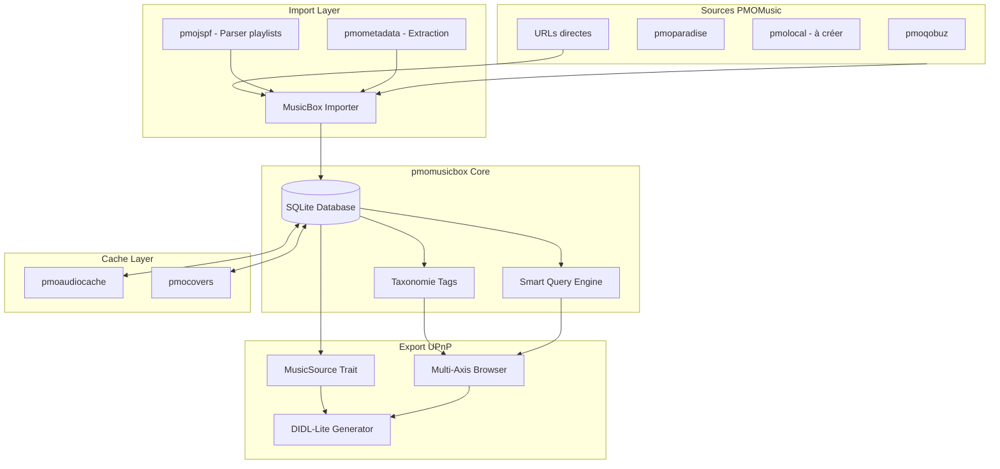
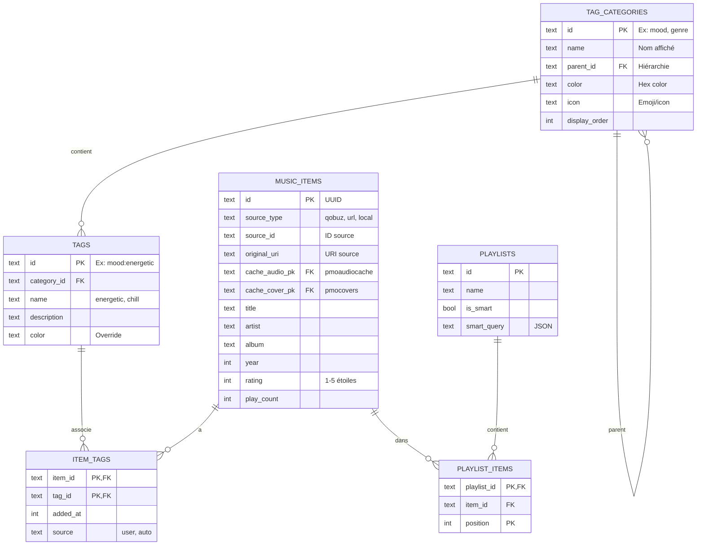
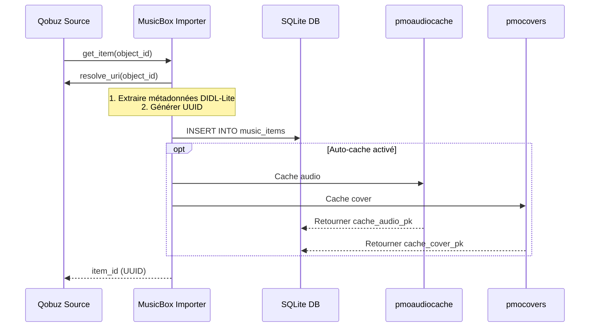
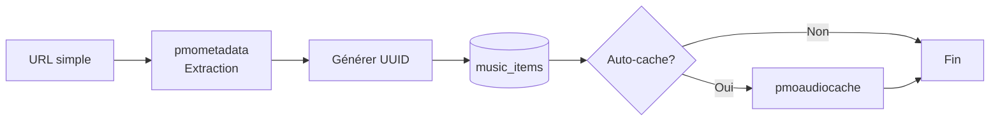
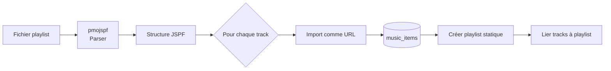
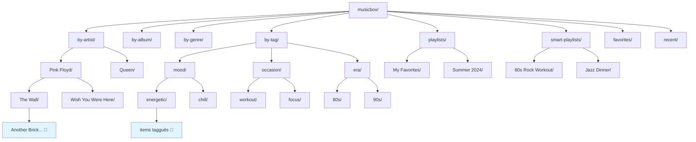

**Il faut suivre les instructions générales placées dans le fichier : Blackboard/Rules.md**

# MusicBoxSource : Bibliothèque musicale universelle

Créer une **"boîte à musique"** personnelle : un catalogue unifié de morceaux provenant de n'importe quelle source (Qobuz, URLs, fichiers locaux, Radio Paradise, etc.), avec taxonomie de tags et playlists intelligentes.

---

## 🎯 Vision

### Concept

**MusicBoxSource** est une bibliothèque musicale curatoriale qui permet de :
- **Collecter** : Ajouter des morceaux depuis n'importe quelle source PMOMusic ou URL
- **Organiser** : Classifier avec une taxonomie de tags extensible
- **Requêter** : Créer des playlists statiques et smart playlists (requêtes dynamiques)
- **Exposer** : Servir via UPnP/DIDL-Lite avec navigation multi-axes

### Différence avec `pmoplaylist`

- **`pmoplaylist`** : Playlists FIFO **éphémères** pour sources live (Radio Paradise)
- **`pmomusicbox`** : Bibliothèque **persistante** cross-sources avec métadonnées enrichies

---

## 🏛️ Architecture globale



---

## 🗄️ Modèle de données (SQLite)

### Tables principales



### Tables d'association

- **`item_tags`** : Liens items ↔ tags (N:M)
- **`playlist_items`** : Items dans playlists statiques (position, ordre)
- **`tag_synonyms`** : Synonymes pour recherche (ex: "jazz" → "swing")

### Index & Recherche

- **Indexes B-tree** : artist, album, genre, year, rating, play_count
- **FTS5 (Full-Text Search)** : title, artist, album, comment
- **Triggers** : Maintien des tables FTS en sync avec `music_items`

---

## 🎨 Taxonomie par défaut

Catégories préchargées à l'initialisation :

| Catégorie   | Description                      | Exemples de tags                           |
|-------------|----------------------------------|--------------------------------------------|
| **Mood**    | État d'esprit, émotion           | energetic, chill, melancholic, happy       |
| **Genre**   | Style musical                    | rock, jazz, classical, electronic, metal   |
| **Era**     | Période, décennie                | 60s, 70s, 80s, 90s, contemporary           |
| **Occasion**| Contexte d'écoute                | workout, focus, party, driving, sleep      |
| **Tempo**   | Vitesse                          | slow, medium, fast                         |
| **Instrument** | Instrument dominant           | piano, guitar, vocal, synthesizer          |
| **Quality** | Qualité audio                    | lossless, high-res, remastered, live       |
| **Origin**  | Origine géographique             | usa, uk, france, japan, latin, africa      |

**Extensibilité** : L'utilisateur peut créer ses propres catégories et tags.

---

## 📦 Crates architecture

### 1. **`pmojspf`** - Parser de playlists (utilitaire)

**But** : Parser/écrire différents formats de playlists vers/depuis un format pivot JSPF (JSON).

```
pmojspf/
├── model.rs        # Structures JSPF (Playlist, Track, Meta)
├── reader/
│   ├── jspf.rs     # JSON natif
│   ├── xspf.rs     # XML (via quick-xml ou crate xspf)
│   ├── m3u.rs      # M3U/M3U8 (parsing ligne par ligne)
│   └── pls.rs      # PLS (format INI-like)
└── writer.rs       # Export JSPF
```

**Dépendances** : `serde`, `serde_json`, `quick-xml` (ou `xspf` crate)

**Usage** : Réutilisé par `pmomusicbox` pour import/export

---

### 2. **`pmomusicbox`** - Bibliothèque musicale core

**Responsabilités** :
- Gestion base SQLite (CRUD items, tags, playlists)
- Import depuis sources PMO (Qobuz, Paradise, Local, URLs)
- Smart playlists (query builder + exécution SQL)
- Implémentation `MusicSource` trait (exposition UPnP)
- Intégration caches audio/covers

```
pmomusicbox/
├── db/
│   ├── schema.rs       # DDL SQLite + migrations
│   ├── items.rs        # CRUD music_items
│   ├── tags.rs         # CRUD tags + taxonomie
│   ├── playlists.rs    # CRUD playlists statiques
│   ├── smart.rs        # Smart playlists
│   └── search.rs       # Full-text search (FTS5)
│
├── import/
│   ├── url.rs          # Import URL directe
│   ├── source.rs       # Import depuis MusicSource
│   ├── local.rs        # Import fichiers locaux (via pmometadata)
│   └── playlist.rs     # Import JSPF/M3U8 (via pmojspf)
│
├── export/
│   └── playlist.rs     # Export playlists (JSPF, M3U8)
│
├── query/
│   ├── builder.rs      # SmartPlaylistQuery (DSL)
│   └── executor.rs     # Génération + exécution SQL
│
├── didl/
│   └── generator.rs    # Conversion items → DIDL-Lite
│
├── source.rs           # Impl MusicSource trait
├── taxonomy.rs         # Taxonomie par défaut + CRUD
└── config_ext.rs       # Extension pmoconfig
```

**Dépendances** :
- `pmosource`, `pmoaudiocache`, `pmocovers`, `pmodidl`, `pmometadata`
- `pmojspf` (import/export playlists)
- `rusqlite` (features: `bundled`, `serde_json`)
- `uuid`, `serde`, `tokio`, `async-trait`

---

### 3. **`pmolocal`** - Source fichiers locaux (à créer)

**But** : Scanner des répertoires locaux et exposer les fichiers audio via `MusicSource`.

```
pmolocal/
├── scanner.rs      # Scan récursif de répertoires
├── watcher.rs      # Hot reload (notify)
├── source.rs       # Impl MusicSource
└── config_ext.rs   # Extension pmoconfig
```

**Workflow** :
1. `pmolocal` scanne `/home/user/Music`
2. `pmomusicbox` importe les items découverts
3. Tags automatiques basés sur métadonnées (genre, année)

---

## 🔄 Flux d'import

### Import depuis une source PMO (ex: Qobuz)



### Import URL directe



### Import playlist JSPF/M3U8



---

## 🔍 Smart Playlists (Query DSL)

### Concept

Les smart playlists sont des **requêtes sauvegardées** qui génèrent dynamiquement une liste de tracks.

### Structure de requête (JSON)

```json
{
  "include_all_tags": ["mood:energetic", "genre:rock"],
  "exclude_tags": ["mood:melancholic"],
  "year_min": 1980,
  "year_max": 1989,
  "min_rating": 4,
  "lossless_only": true,
  "order_by": "play_count",
  "order": "desc",
  "limit": 50
}
```

### Traduction SQL

```sql
SELECT * FROM music_items
WHERE id IN (
    SELECT item_id FROM item_tags WHERE tag_id IN ('mood:energetic', 'genre:rock')
    GROUP BY item_id HAVING COUNT(DISTINCT tag_id) = 2  -- ALL tags
)
AND id NOT IN (
    SELECT item_id FROM item_tags WHERE tag_id = 'mood:melancholic'
)
AND year BETWEEN 1980 AND 1989
AND rating >= 4
AND codec IN ('flac', 'alac')
ORDER BY play_count DESC
LIMIT 50;
```

---

## 🎭 Exposition UPnP (MusicSource)

### Structure de navigation



### Object IDs

```
musicbox:by-artist:{artist_name}
musicbox:by-album:{album_id}
musicbox:by-tag:{category}:{tag_name}
musicbox:playlist:{playlist_id}
musicbox:smart:{smart_playlist_id}
musicbox:item:{item_id}
```

---

## 🔌 Intégration avec l'écosystème PMOMusic

### Avec pmoaudiocache

- Import → Déclencher cache automatique (si `auto_cache: true`)
- `resolve_uri()` → Retourner URI cachée si disponible

### Avec pmocovers

- Import → Télécharger cover art
- Browse → Inclure `album_art` dans DIDL-Lite

### Avec pmoserver (feature `server`)

- API REST pour manipulation (CRUD items, tags, playlists)
- SSE pour notifications de changements
- Endpoints OpenAPI (utoipa)

---

## 📝 Plan d'implémentation (Phases)

### Phase 1 : Fondations
- Schéma SQLite complet
- Crate `pmojspf` (parser playlists)
- CRUD basique dans `pmomusicbox` (items, tags)
- Taxonomie par défaut
- Import URL simple
- Extension pmoconfig

### Phase 2 : Import cross-sources
- Import depuis MusicSource (Qobuz, Paradise)
- Import playlists (JSPF/M3U8)
- Intégration caches (audio, covers)
- Crate `pmolocal` (fichiers locaux)

### Phase 3 : Smart Playlists
- Query builder (DSL)
- Exécuteur SQL
- CRUD smart playlists
- Export JSPF

### Phase 4 : MusicSource UPnP
- Implémentation trait `MusicSource`
- Génération DIDL-Lite
- Browse multi-axes (artist, album, tag)
- Recherche full-text (FTS5)

### Phase 5 : Fonctionnalités avancées
- Statistiques d'écoute (play_count, last_played)
- Auto-tagging (genre depuis métadonnées)
- API REST (feature `server`)
- Recommandations (items similaires)

---

## 🎯 Cas d'usage

### Workflow typique

1. **Découverte** : Écouter Radio Paradise, tomber sur un morceau génial
2. **Ajout** : `musicbox.import_from_source(&paradise, "track-123")`
3. **Organisation** : Ajouter tags `mood:chill`, `occasion:focus`
4. **Playlist** : Smart playlist "Focus Music" avec requête `mood:chill + occasion:focus`
5. **Écoute** : Naviguer dans UPnP → `musicbox/smart-playlists/Focus Music/`

### Scénario : Bibliothèque mixte

- Albums Qobuz haute résolution
- Playlists M3U8 importées depuis iTunes
- Fichiers FLAC locaux scannés
- URLs de SoundCloud
- Tracks Radio Paradise capturés

**Tout unifié dans MusicBox, accessible via UPnP, organisé par tags.**

---

## 📚 Références

### Standards
- [JSPF Spec](https://www.xspf.org/jspf)
- [XSPF Spec](https://www.xspf.org/spec)
- [SQLite FTS5](https://www.sqlite.org/fts5.html)

### Inspirations
- [Beets](https://beets.io/) - Music library manager
- [Navidrome](https://www.navidrome.org/) - Music server
- [MusicBrainz Picard](https://picard.musicbrainz.org/) - Tagger
