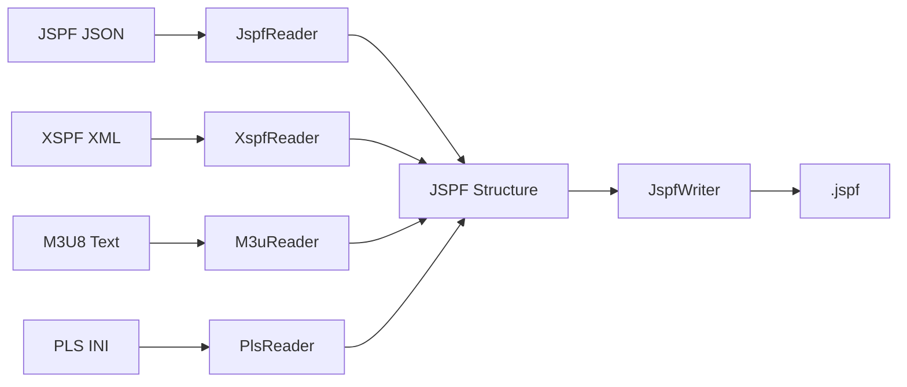

**Il faut suivre les instructions générales placées dans le fichier : Blackboard/Rules.md**

# PlaylistSource : MusicSource pour playlists

Implémenter une source PMOMusic capable de servir un catalogue de playlists hiérarchisé via UPnP.

---

## 📋 Décisions de conception

### Format pivot : JSPF (JSON)

**Choix** : JSPF comme format interne central
- Métadonnées riches (title, creator, album, annotation, image, duration, etc.)
- JSON natif avec serde (Rust-friendly)
- Standard ouvert (Xiph.Org)
- Extensible via champ `meta`

**Formats supportés** :
- ✅ **JSPF** (.jspf) - JSON, format natif
- ✅ **XSPF** (.xspf) - XML, conversion vers JSPF
- ✅ **M3U8** (.m3u8) - Texte, métadonnées limitées
- ✅ **PLS** (.pls) - INI-like, très basique

**Architecture** : 1 Writer (JSPF) + 4 Readers (JSPF, XSPF, M3U8, PLS) → Structure JSPF centrale



---

## 🗂️ Structure du répertoire

```
playlists/
├── metadata.json              # Métadonnées du conteneur racine
├── Jazz/
│   ├── metadata.json          # Métadonnées catégorie Jazz
│   ├── standards.jspf
│   ├── bebop.jspf
│   └── covers/
│       └── standards.webp
├── Classical/
│   ├── metadata.json
│   ├── baroque.jspf
│   └── romantic.jspf
└── Rock/
    ├── metadata.json
    └── 70s.jspf
```

### Fichier `metadata.json` (conteneur)

```json
{
  "container": {
    "title": "Collection Jazz",
    "description": "Mes playlists jazz favorites",
    "creator": "John Doe",
    "image": "covers/jazz-collection.webp",
    "date": "2026-01-15",
    "meta": [
      {"rel": "genre", "content": "Jazz"},
      {"rel": "mood", "content": "Relaxing"}
    ]
  }
}
```

---

## 🏗️ Composants à implémenter

### 1. Crate `pmojspf` (parsing playlists)

**Responsabilité** : Parser différents formats de playlist vers structure JSPF unifiée

#### Structure

```
pmojspf/
├── Cargo.toml
├── src/
│   ├── lib.rs           # API publique
│   ├── model.rs         # Structures JSPF
│   ├── writer.rs        # JspfWriter
│   ├── reader/
│   │   ├── mod.rs       # Trait PlaylistReader
│   │   ├── jspf.rs      # Reader JSON natif (serde_json)
│   │   ├── xspf.rs      # Reader XML (xml-rs)
│   │   ├── m3u.rs       # Reader M3U8 (parsing ligne par ligne)
│   │   └── pls.rs       # Reader PLS (format INI-like)
│   └── error.rs
└── tests/
    └── fixtures/
```

#### Modèle de données

**Inspiré de la crate [xspf](https://crates.io/crates/xspf) v0.4.2**

```rust
use serde::{Deserialize, Serialize};

#[derive(Debug, Clone, Serialize, Deserialize)]
pub struct Jspf {
    pub playlist: JspfPlaylist,
}

#[derive(Debug, Clone, Serialize, Deserialize, Default)]
#[serde(rename_all = "camelCase")]
pub struct JspfPlaylist {
    #[serde(skip_serializing_if = "Option::is_none")]
    pub title: Option<String>,
    #[serde(skip_serializing_if = "Option::is_none")]
    pub creator: Option<String>,
    #[serde(skip_serializing_if = "Option::is_none")]
    pub annotation: Option<String>,
    #[serde(skip_serializing_if = "Option::is_none")]
    pub info: Option<String>,
    #[serde(skip_serializing_if = "Option::is_none")]
    pub location: Option<String>,
    #[serde(skip_serializing_if = "Option::is_none")]
    pub identifier: Option<String>,
    #[serde(skip_serializing_if = "Option::is_none")]
    pub image: Option<String>,
    #[serde(skip_serializing_if = "Option::is_none")]
    pub date: Option<String>,
    #[serde(skip_serializing_if = "Option::is_none")]
    pub license: Option<String>,
    #[serde(skip_serializing_if = "Vec::is_empty", default)]
    pub attribution: Vec<JspfAttribution>,
    #[serde(skip_serializing_if = "Vec::is_empty", default)]
    pub meta: Vec<JspfMeta>,
    #[serde(default)]
    pub track: Vec<JspfTrack>,
}

#[derive(Debug, Clone, Serialize, Deserialize, Default)]
#[serde(rename_all = "camelCase")]
pub struct JspfTrack {
    #[serde(skip_serializing_if = "Vec::is_empty", default)]
    pub location: Vec<String>,
    #[serde(skip_serializing_if = "Vec::is_empty", default)]
    pub identifier: Vec<String>,
    #[serde(skip_serializing_if = "Option::is_none")]
    pub title: Option<String>,
    #[serde(skip_serializing_if = "Option::is_none")]
    pub creator: Option<String>,
    #[serde(skip_serializing_if = "Option::is_none")]
    pub annotation: Option<String>,
    #[serde(skip_serializing_if = "Option::is_none")]
    pub info: Option<String>,
    #[serde(skip_serializing_if = "Option::is_none")]
    pub image: Option<String>,
    #[serde(skip_serializing_if = "Option::is_none")]
    pub album: Option<String>,
    #[serde(skip_serializing_if = "Option::is_none")]
    pub track_num: Option<u32>,
    #[serde(skip_serializing_if = "Option::is_none")]
    pub duration: Option<u64>,  // millisecondes
    #[serde(skip_serializing_if = "Vec::is_empty", default)]
    pub meta: Vec<JspfMeta>,
}

#[derive(Debug, Clone, Serialize, Deserialize)]
#[serde(untagged)]
pub enum JspfAttribution {
    Location { location: String },
    Identifier { identifier: String },
}

#[derive(Debug, Clone, Serialize, Deserialize)]
pub struct JspfMeta {
    pub rel: String,
    pub content: String,
}
```

#### Trait PlaylistReader

```rust
use std::io::Read;

pub trait PlaylistReader {
    fn read<R: Read>(reader: R) -> Result<Jspf>;
    fn from_str(s: &str) -> Result<Jspf>;
    fn from_file<P: AsRef<Path>>(path: P) -> Result<Jspf>;
}
```

#### Implémentations des Readers

##### JspfReader (✅ Simple - serde_json)

```rust
pub struct JspfReader;

impl PlaylistReader for JspfReader {
    fn read<R: Read>(reader: R) -> Result<Jspf> {
        serde_json::from_reader(reader)
            .map_err(|e| Error::ParseError(format!("JSON: {}", e)))
    }
}
```

**Dépendances** : `serde_json`

##### XspfReader (⚠️ Complexe - xml-rs)

**Approche** : Machine à états XML pour parser `<playlist>`, `<track>`, etc.

**Alternative** : Utiliser la crate `xspf` existante puis convertir → JSPF

```rust
pub struct XspfReader;

impl PlaylistReader for XspfReader {
    fn read<R: Read>(reader: R) -> Result<Jspf> {
        // Parser XML avec EventReader
        // État : in_playlist, in_track, current_element
        // Mapping: <title> → playlist.title, <track> → JspfTrack
    }
}
```

**Dépendances** : `xml-rs` ou réutiliser `xspf` crate

##### M3uReader (⚙️ Modéré - ligne par ligne)

**Format** :
```m3u
#EXTM3U
#PLAYLIST:Ma Playlist Jazz
#EXTINF:284,John Coltrane - Giant Steps
#EXTART:John Coltrane
#EXTALB:Giant Steps
file:///music/coltrane.flac
```

```rust
pub struct M3uReader;

impl PlaylistReader for M3uReader {
    fn read<R: Read>(reader: R) -> Result<Jspf> {
        // BufReader ligne par ligne
        // Parser #EXTINF:duration,artist - title
        // Gérer extensions non-standard (#EXTART, #EXTALB, #EXTIMG)
    }
}
```

**Dépendances** : stdlib uniquement

**Limitations** : Métadonnées pauvres, beaucoup de champs `None`

##### PlsReader (⚙️ Modéré - format INI)

**Format** :
```ini
[playlist]
NumberOfEntries=2
File1=file:///music/coltrane.flac
Title1=John Coltrane - Giant Steps
Length1=284
```

```rust
pub struct PlsReader;

impl PlaylistReader for PlsReader {
    fn read<R: Read>(reader: R) -> Result<Jspf> {
        // HashMap<index, (file, title, duration)>
        // Parser FileN=..., TitleN=..., LengthN=...
        // Trier par index et convertir en JspfTrack
    }
}
```

**Dépendances** : stdlib uniquement

**Limitations** : File, Title, Length seulement

#### JspfWriter

```rust
pub struct JspfWriter;

impl JspfWriter {
    pub fn write<W: Write>(jspf: &Jspf, writer: W) -> Result<()>;
    pub fn write_pretty<W: Write>(jspf: &Jspf, writer: W) -> Result<()>;
    pub fn to_string(jspf: &Jspf) -> Result<String>;
    pub fn to_string_pretty(jspf: &Jspf) -> Result<String>;
}
```

#### API publique

```rust
pub use model::{Jspf, JspfPlaylist, JspfTrack, JspfMeta, JspfAttribution};
pub use reader::{PlaylistReader, JspfReader, XspfReader, M3uReader, PlsReader};
pub use writer::JspfWriter;

pub enum PlaylistFormat {
    Jspf,
    Xspf,
    M3u8,
    Pls,
}

impl PlaylistFormat {
    pub fn from_extension(ext: &str) -> Option<Self>;
}

pub fn read_playlist<R: Read>(reader: R, format: PlaylistFormat) -> Result<Jspf>;
```

---

### 2. Crate `pmoplaylists` (PlaylistSource)

**Responsabilité** : Implémenter `MusicSource` pour servir playlists via UPnP

#### Structures principales

```rust
pub struct PlaylistSource {
    root_path: PathBuf,
    playlists: Arc<RwLock<HashMap<String, ParsedPlaylist>>>,
    containers: Arc<RwLock<HashMap<PathBuf, ContainerMetadata>>>,
    watcher: Option<notify::RecommendedWatcher>,
    base_url: String,
    update_counter: Arc<RwLock<u32>>,
    last_change: Arc<RwLock<SystemTime>>,
}

pub struct ParsedPlaylist {
    pub metadata: PlaylistMetadata,
    pub tracks: Vec<PlaylistTrack>,
    pub source_path: PathBuf,
    pub format: PlaylistFormat,
}

pub struct ContainerMetadata {
    pub title: Option<String>,
    pub description: Option<String>,
    pub creator: Option<String>,
    pub image: Option<String>,
    pub date: Option<String>,
    pub meta: Vec<MetaEntry>,
}

pub struct ContainerMetadataFile {
    pub container: ContainerMetadata,
}
```

#### Fonctionnalités

1. **Scan hiérarchique** : Parser récursivement dossiers + `metadata.json` + playlists
2. **Cache** : Éviter re-parsing (playlists + conteneurs)
3. **Hot reload** : `notify` pour détecter changements
4. **Browse UPnP** : Générer DIDL-Lite avec métadonnées conteneurs
5. **Content resolution** : Résoudre URIs via `SourceCacheManager`
6. **Cover art** : Servir images playlists, tracks, conteneurs

#### Object IDs

```
playlists                                # Racine
playlists:category:{path}                # Catégorie (dossier)
playlists:playlist:{id}                  # Playlist
playlists:playlist:{id}:track:{index}    # Track dans playlist
```

#### Gestion `metadata.json`

```rust
fn load_container_metadata(&self, dir_path: &Path) -> Result<ContainerMetadata> {
    let metadata_path = dir_path.join("metadata.json");
    
    if metadata_path.exists() {
        let content = fs::read_to_string(&metadata_path)?;
        let file: ContainerMetadataFile = serde_json::from_str(&content)?;
        Ok(file.container)
    } else {
        // Fallback : nom du répertoire
        Ok(ContainerMetadata {
            title: Some(dir_path.file_name()?.to_str()?.to_string()),
            ..Default::default()
        })
    }
}
```

---

### 3. Extension pmoconfig

**Fichier** : `pmoplaylists/src/config_ext.rs`

**Pattern** : [pmoconfig_ext.md](../Architecture/pmoconfig_ext.md)

```rust
use pmoconfig::Config;
use std::path::{Path, PathBuf};

const DEFAULT_PLAYLISTS_DIR: &str = "playlists";

pub trait PlaylistSourceConfigExt {
    fn get_playlists_dir(&self) -> PathBuf;
    fn set_playlists_dir<P: AsRef<Path>>(&self, path: P) -> anyhow::Result<()>;
    fn get_playlists_enabled(&self) -> bool;
    fn set_playlists_enabled(&self, enabled: bool) -> anyhow::Result<()>;
    fn get_playlists_supported_formats(&self) -> Vec<String>;
    fn set_playlists_supported_formats(&self, formats: Vec<String>) -> anyhow::Result<()>;
}

impl PlaylistSourceConfigExt for Config {
    fn get_playlists_dir(&self) -> PathBuf {
        self.get_managed_dir("sources.playlists.directory", DEFAULT_PLAYLISTS_DIR)
            .expect("Failed to get playlists directory")
    }
    
    fn set_playlists_dir<P: AsRef<Path>>(&self, path: P) -> anyhow::Result<()> {
        self.set_managed_dir("sources.playlists.directory", path)
    }
    
    fn get_playlists_enabled(&self) -> bool {
        self.get_value("sources.playlists.enabled")
            .unwrap_or_else(|_| {
                let _ = self.set_value("sources.playlists.enabled", true);
                true
            })
    }
    
    fn set_playlists_enabled(&self, enabled: bool) -> anyhow::Result<()> {
        self.set_value("sources.playlists.enabled", enabled)
    }
    
    fn get_playlists_supported_formats(&self) -> Vec<String> {
        self.get_value("sources.playlists.formats")
            .unwrap_or_else(|_| {
                let default = vec!["jspf".into(), "xspf".into(), "m3u8".into(), "pls".into()];
                let _ = self.set_value("sources.playlists.formats", &default);
                default
            })
    }
    
    fn set_playlists_supported_formats(&self, formats: Vec<String>) -> anyhow::Result<()> {
        self.set_value("sources.playlists.formats", formats)
    }
}
```

**Config YAML** :

```yaml
sources:
  playlists:
    enabled: true
    directory: "playlists"
    formats:
      - jspf
      - xspf
      - m3u8
      - pls
```

**Utilisation** :

```rust
use pmoconfig::Config;
use pmoplaylists::config_ext::PlaylistSourceConfigExt;

let config = Config::load()?;

if config.get_playlists_enabled() {
    let playlists_dir = config.get_playlists_dir();
    let playlist_source = PlaylistSource::new(playlists_dir, config.clone())?;
}
```

---

## 🔌 Intégration MusicBrainz (optionnelle - Phase 2)

### Crate recommandée : `musicbrainz_rs`

[musicbrainz_rs](https://crates.io/crates/musicbrainz_rs) v0.5+
- Client async/blocking
- Rate limiting automatique (1 req/sec)
- Support CoverArt Archive
- MSRV: Rust 1.71.1

### Cas d'usage

1. **Résolution d'identifiants** :
   ```json
   {"identifier": ["musicbrainz://recording/abc123"], "title": null}
   ```
   → Récupérer métadonnées depuis MusicBrainz

2. **Enrichissement playlists pauvres** : M3U8/PLS → MusicBrainz → métadonnées complètes

3. **Cover art** : CoverArt Archive

### Configuration

```yaml
sources:
  playlists:
    musicbrainz:
      enabled: false
      enrich_metadata: false
      rate_limit_per_sec: 1
```

**Stratégie** :
- **Phase 1 (MVP)** : Ne pas implémenter, stocker identifiants tel quel
- **Phase 2** : Dépendance optionnelle, service asynchrone, configurable

---

## 📝 Prochaines étapes

1. ✅ Choix format : JSPF central
2. ✅ Modèle données : Structures JSPF
3. ✅ Extension pmoconfig : Trait défini
4. ⏳ **Implémenter `pmojspf`** :
   - `JspfReader` (serde_json)
   - `XspfReader` (xml-rs ou crate xspf)
   - `M3uReader` (parsing ligne par ligne)
   - `PlsReader` (format INI)
   - `JspfWriter` (serde_json)
5. ⏳ **Implémenter `pmoplaylists`** :
   - `PlaylistSource` (trait `MusicSource`)
   - Scan hiérarchique + cache
   - Hot reload (notify)
   - Browse UPnP (DIDL-Lite)
   - Gestion `metadata.json`
6. ⏳ Tests avec clients UPnP

---

## 📚 Sources

### Spécifications
- [XSPF Spec](https://www.xspf.org/spec)
- [JSPF Spec](https://www.xspf.org/jspf)
- [M3U - Wikipedia](https://en.wikipedia.org/wiki/M3U)
- [PLS - Wikipedia](https://en.wikipedia.org/wiki/PLS_(file_format))

### Crates Rust
- [xspf](https://crates.io/crates/xspf) - Parser XML XSPF
- [musicbrainz_rs](https://crates.io/crates/musicbrainz_rs) - API MusicBrainz
- [MusicBrainz API Docs](https://musicbrainz.org/doc/MusicBrainz_API)
