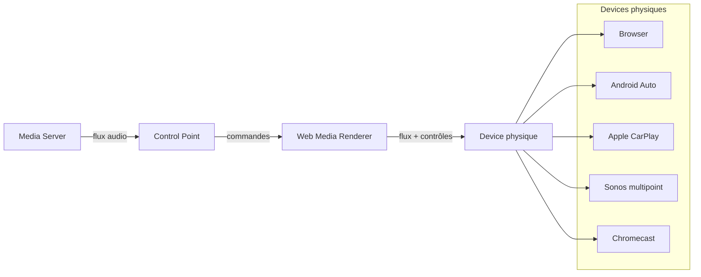
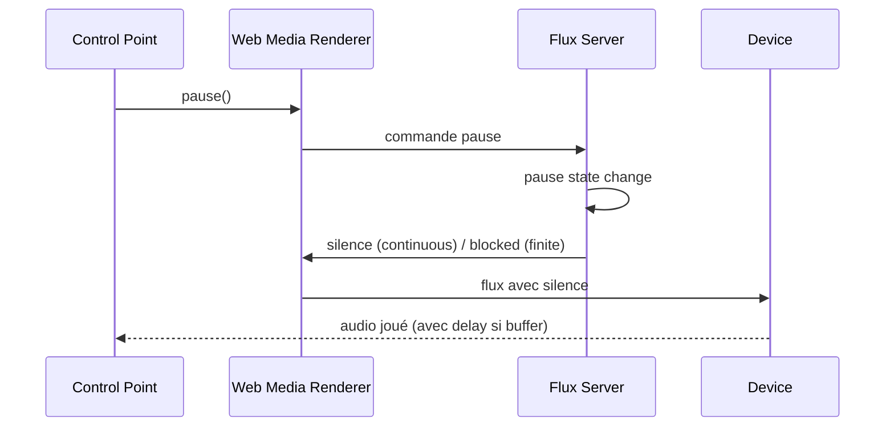
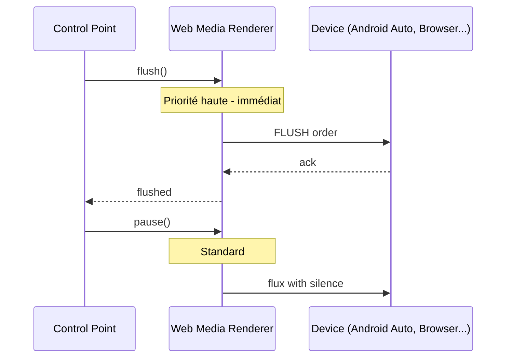
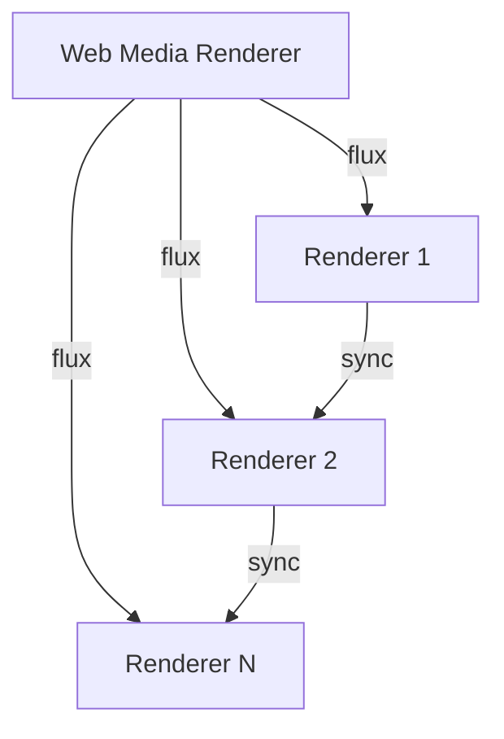

# Web Media Renderer - Architecture

## Vision

Système de Media Renderer pilotable à distance via UPnP, exposant un flux audio vers différents types de lecteurs physiques.

## Architecture globale en 4 parties



### Rôles

1. **Media Server** - Source audio (le flux OGG-FLAC existant)
2. **Control Point** - Interface UI qui envoie les commandes (pause, play, seek, next, prev)
3. **Web Media Renderer** - Hub qui expose le flux et traduit les commandes selon le device
4. **Physical Device** - Lecteur final (browser, voiture, Sonos, Chromecast...)

## Web Media Renderer - Rôle central

```mermaid
blockdiag
{
    block = Commandes UPnP
    block -> "Web Media Renderer" -> Adaptation selon device
    "Web Media Renderer" -> Device-specific protocols
}
```

### Rôle central: Adaptateur

Le Web Media Renderer est un **adaptateur** qui:
- **Reçoit le flux** du Media Server (OGG-FLAC)
- **Reçoit les commandes** du Control Point (UPnP)
- **Les traduit** vers les devices physiques
- **Expose une API de contrôle** commune

### Ce qui est COMMUN (factorisé)

| Layer | Description |
|-------|-------------|
| **API contrôle** | pause, resume, seek, next, prev, flush, stop |
| **Métadonnées** | /nowplaying, /metadata, /state |
| **Flux audio** | OGG-FLAC (identique pour tous) |
| **StreamType** | Continuous vs Finite |

### Ce qui est SPÉCIFIQUE (par device)

| Device | Transport | Buffer Management | Sync |
|--------|-----------|-------------------|------|
| Browser | HTTP/WebSocket | JS flush | N/A |
| Android Auto | AA API | native | varies |
| CarPlay | CP API | native | varies |
| Sonos | UPnP | none | UPnP |
| Chromecast | Cast API | none | Cast |

### Problème du buffer (Browser)

Le browser buffer cause des delais de reaction:
- **Pause**: delai de 5 secondes
- **Seek**: cherche dans le buffer, pas dans le nouveau flux
- **Next/Prev**: changement reporte

**Solutions**:
1. Web Audio API - `audioContext.suspend()/resume()` - plus petit buffer (~50ms)
2. Frontend flush buffer
3. Chaque client manage son propre buffer, Web Media Renderer juste expose API

## Implémentation actuelle

### Faits

- Flux audio OGG-FLAC ✓
- Pause/Resume ✓ (via `OggFlacStreamHandle`)
- TrackBoundary pour OGG segments
- StreamType (Continuous vs Finite)

### À faire

- seek/next/prev API
- WebSocket pour temps réel
- Metadata endpoint (/nowplaying JSON)
- MPV integration (multi-point/multi-room)

## Code actuel - Pause/Resume

```rust
// OggFlacStreamHandle - méthodes de contrôle
pub fn pause(&self) {
    self.inner.is_paused.store(true, Ordering::SeqCst);
}

pub fn resume(&self) {
    self.inner.is_paused.store(false, Ordering::SeqCst);
}

pub fn is_paused(&self) -> bool {
    self.inner.is_paused.load(Ordering::SeqCst)
}
```

### Différences Continuous vs Finite

- **Continuous** (radio): pause -> sends silence, drops incoming chunks
- **Finite** (tracks): pause -> don't receive chunks (backpressure), loops sending silence

## Schéma d'intégration



## Le Web Media Renderer - Adaptateur

Le rôle central du Web Media Renderer est de **convertir des ordres UPnP en actions spécifiques** selon le device cible:

```
UPnP orders → [Web Media Renderer] → Device-specific actions
```

## Browser Player - Composant web invisible

Pour s'entraîner, on peut se focaliser sur un composant web qui:
- Est **complètement invisible** (pas de UI)
- Est **télécommandable** par le Web Media Renderer
- Joue la musique dans le navigateur

### Specifications

| Requirement | Description |
|-------------|-------------|
| Invisible | Pas de UI, pas de controls, pas de visuel |
| Remote control | Reçoit commandes via WebSocket/HTTP |
| Auto-reconnect | Reconnection si stream coupé |
| Buffer management | Flush commandée |
| Audio format | OGG-FLAC stream |

### Architecture en 2 parties

| Partie | Langage | Rôle |
|--------|---------|------|
| Backend | Rust (pmoaudio-ext) | Contrôle, flux OGG-FLAC |
| Frontend | JavaScript | Player invisible dans le browser |

#### Backend (Rust)

- Expose le flux audio (`/stream`)
- API contrôle (`/pause`, `/resume`, `/seek`, `/flush`, `/stop`)
- WebSocket pour temps réel (`/ws`)
- **Reçoit les rapports de position/state**

```rust
// Endpoints existants
POST /pause
POST /resume  
POST /seek?t={timestamp}
POST /flush
POST /stop

// Stream
GET /stream

// WebSocket messages REÇUS du player:
{
    "type": "position",
    "position_sec": 125.5,
    "duration_sec": 240.0,
    "state": "playing"
}
{
    "type": "track",
    "id": "...",
    "title": "...",
    "artist": "..."
}
{
    "type": "ready_state",
    "ready_state": "canplay"
}
```

#### Frontend (JavaScript)

Composant minimal (~100 lignes):

```javascript
class RemotePlayer {
    constructor(wsUrl) {
        this.ws = new WebSocket(wsUrl);
        this.audio = new Audio();
        this.ac = new AudioContext();
        
        this.ws.onmessage = (e) => this.handle(e.data);
    }
    
    handle(msg) {
        switch(msg.type) {
            case 'stream': this.load(msg.url); break;
            case 'play': this.play(); break;
            case 'pause': this.pause(); break;
            case 'seek': this.seek(msg.timestamp); break;
            case 'flush': this.flush(); break;
            case 'stop': this.stop(); break;
        }
    }
    
    load(url) {
        this.audio.src = url;
    }
    
    play() {
        this.audio.play();
    }
    
    pause() {
        this.audio.pause();
    }
    
    seek(ts) {
        this.audio.currentTime = ts;
    }
    
    flush() {
        // Flush buffer immediatement
        this.audio.pause();
        this.audio.currentTime = 0;
        this.audio.src = '';
        this.ac.suspend();
    }
    
    stop() {
        this.flush();
    }
}
```

**Usage:**

```html
<script src="pmo-player.js"></script>
<script>
    const player = new PMOPlayer('ws://localhost:8080/ws');
</script>
```

### Fichier à créer

`pmoapp/webapp/src/services/PMOPlayer.ts`

### Endpoints HTTP

| Endpoint | Methode | Description |
|----------|---------|-------------|
| `/api/webrenderer/register` | POST | Enregistre instance |
| `/api/webrenderer/{id}/stream` | GET | Flux audio OGG-FLAC |
| `/api/webrenderer/{id}/position` | POST | Rapporte position |
| `/api/webrenderer/{id}/report` | POST | Rapporte etat player |
| `/api/webrenderer/{id}/command` | GET | Recupere commande pending |
| `/api/webrenderer/{id}` | DELETE | Desenregistre |

### Architecture

```
Player (Browser) <--HTTP--> Backend
  - Report: position/state via POST /report
  - Poll: command via GET /command (500ms)
  - Stream: GET /stream
```

### Réactivité

Pour maximiser la réactivité:

| Technique | Impact |
|-----------|--------|
| WebSocket | Temps réel vs HTTP polling |
| AudioContext.suspend() | Buffer ~50ms au lieu de ~5s |
| Flush command | Vide le buffer immediatement |
| Native HTML5 audio | Le plus simple = le plus stable |

### Schéma

```mermaid
sequenceDiagram
    participant WMR as Web Media Renderer
    participant BP as Browser Player
    
    WMR->>BP: stream(url)
    BP->>BP: audio.src = url; play()
    
    WMR->>BP: pause()
    BP->>BP: audio.pause()
    
    WMR->>BP: seek(timestamp)
    BP->>BP: audio.currentTime = timestamp
    
    WMR->>BP: flush()
    BP->>BP: audioContext.suspend()
```

### Mapping orders → actions par device

| UPnP order | Browser | Android Auto | CarPlay | Sonos | Chromecast |
|-----------|---------|-------------|--------|------|-------------|
| Play | `audio.play()` | AA play | CP play | UPnP Play | Cast play |
| Pause | `audio.pause()` | AA pause | CP pause | UPnP Pause | Cast pause |
| Resume | `audio.play()` | AA play | CP play | UPnP Play | Cast play |
| Seek | `audio.currentTime=t` | AA seek | CP seek | UPnP Seek | Cast seek |
| Next | fetch new stream | AA next | CP next | UPnP Next | Cast next |
| Prev | fetch new stream | AA prev | CP prev | UPnP Prev | Cast prev |
| Flush | JS `audioContext.suspend()` | AA flush | CP flush | N/A | Cast load |
| Stop | `audio.stop()` | AA stop | CP stop | UPnP Stop | Cast stop |

### Protocole de contrôle

Le Web Media Renderer expose une API de contrôle uniforme qui est traduite selon le device:

### Commandes

| Commande | Description |
|---------|-------------|
| `play` | Lecture |
| `pause` | Pause (silence ou backpressure) |
| `resume` | Reprise |
| `seek(t)` | Seek vers timestamp t |
| `next` | Track suivante |
| `prev` | Track précédente |
| `flush` | **Flush buffer** - ordre critique pour reponse rapide |
| `stop` | Arrêt total |

### Métadonnées

| Endpoint | Description |
|----------|-------------|
| `/nowplaying` | Track actuelle, timestamp, is_paused |
| `/metadata` | TITLE, ARTIST, ALBUM, COVER |
| `/state` | État complet (position, duration, volume...) |

### Ordres spéciaux pour devices avec buffer

Pour les devices типа Android Auto, CarPlay, Browser:
- `flush` = vide le buffer immédiatement
- `stop` = arrête + flush
- Ces ordres doivent être traités en priorité



## multipoint/multi-room



Possibilités:
- UPnP pour renderers UPnP
- Cast API pour Chromecast
- Serveur temps réel pour sync

## Notes techniques

### AudioChunk::silence()

```rust
impl AudioChunk {
    pub fn silence(frames: usize, sample_rate: u32) -> Self {
        AudioChunk::I32(AudioChunkData::<i32>::silence(frames, sample_rate))
    }
}

impl<T: Sample> AudioChunkData<T> {
    pub fn silence(frames: usize, sample_rate: u32) -> Arc<Self> {
        Self::new(vec![[T::ZERO; 2]; frames], sample_rate, 0.0)
    }
}
```

### StreamType

```rust
pub enum StreamType {
    Continuous,  // radio - silence pendant pause
    Finite,       // tracks - backpressure pendant pause
}
```

### TrackBoundary avec StreamType

```rust
SyncMarker::TrackBoundary { 
    metadata: ..., 
    stream_type: StreamType 
}
```