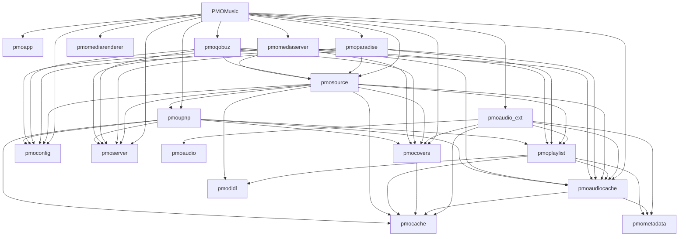

## Diagramme des dépendances PMOMusic (crates internes)

```mermaid
graph TD

    PMOMusic --> pmoapp
    PMOMusic --> pmoaudio_ext
    PMOMusic --> pmoaudiocache
    PMOMusic --> pmocovers
    PMOMusic --> pmoconfig
    PMOMusic --> pmoserver
    PMOMusic --> pmosource
    PMOMusic --> pmoupnp
    PMOMusic --> pmomediaserver
    PMOMusic --> pmomediarenderer
    PMOMusic --> pmoqobuz
    PMOMusic --> pmoparadise

    pmoaudio_ext --> pmoaudio
    pmoaudio_ext --> pmocovers
    pmoaudio_ext --> pmocache
    pmoaudio_ext --> pmoaudiocache
    pmoaudio_ext --> pmometadata
    pmoaudio_ext --> pmoplaylist

    pmoaudiocache --> pmocache
    pmoaudiocache --> pmometadata

    pmocovers --> pmocache

    pmoplaylist --> pmocache
    pmoplaylist --> pmoaudiocache
    pmoplaylist --> pmometadata
    pmoplaylist --> pmodidl

    pmosource --> pmoaudiocache
    pmosource --> pmocovers
    pmosource --> pmocache
    pmosource --> pmoplaylist
    pmosource --> pmodidl
    pmosource --> pmoconfig
    pmosource --> pmoserver
    pmosource --> pmoupnp

    pmoparadise --> pmosource
    pmoparadise --> pmoaudiocache
    pmoparadise --> pmoplaylist
    pmoparadise --> pmoserver
    pmoparadise --> pmoconfig

    pmoqobuz --> pmosource
    pmoqobuz --> pmoaudiocache
    pmoqobuz --> pmocovers
    pmoqobuz --> pmoserver
    pmoqobuz --> pmoconfig

    pmomediaserver --> pmoserver
    pmomediaserver --> pmosource
    pmomediaserver --> pmoconfig
    pmomediaserver --> pmocovers
    pmomediaserver --> pmoaudiocache
    pmomediaserver --> pmoplaylist
    
    pmoupnp --> pmoserver
    pmoupnp --> pmocovers
    pmoupnp --> pmoaudiocache
    pmoupnp --> pmoplaylist
    pmoupnp --> pmocache
    pmoupnp --> pmoconfig
```

> Flèches = “dépend de”. Dépendances externes non représentées. Cette vue correspond aux features activées par défaut dans la workspace.
