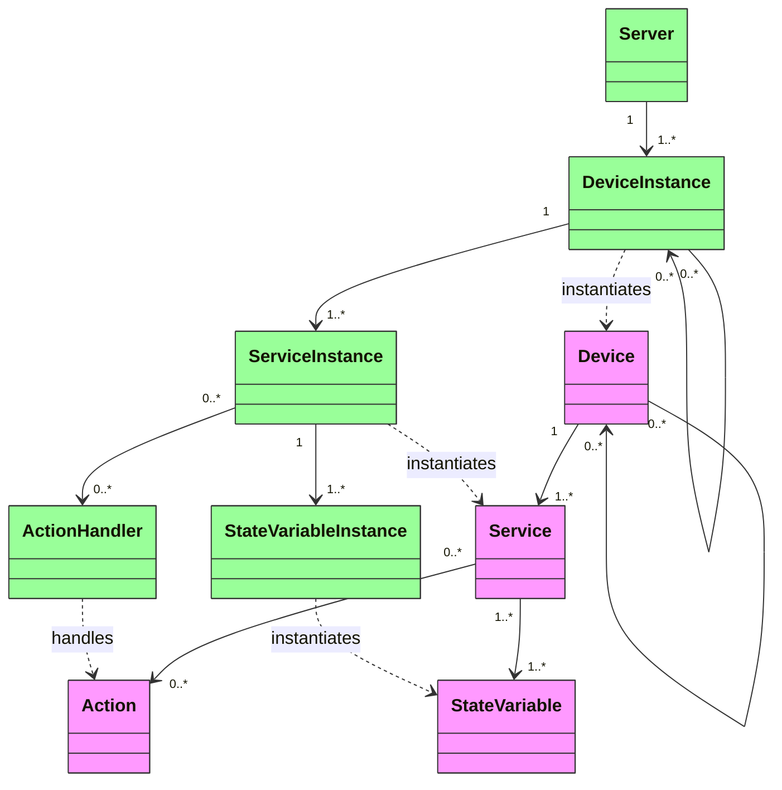

# Architecture UPnP/DLNA

Voici la séparation **définition** vs **runtime** :

```mermaid
classDiagram
  class Device
  class Service
  class Action
  class StateVariable

  class Server
  class DeviceInstance
  class ServiceInstance
  class StateVariableInstance
  class ActionHandler

  Device "1" --> "1..*" Service
  Device "0..*" --> "0..*" Device
  Service "0..*" --> "0..*" Action
  Service "1..*" --> "1..*" StateVariable

  Server "1" --> "1..*" DeviceInstance
  DeviceInstance "1" --> "1..*" ServiceInstance
  DeviceInstance "0..*" --> "0..*" DeviceInstance
  ServiceInstance "1" --> "1..*" StateVariableInstance
  ServiceInstance "0..*" --> "0..*" ActionHandler

  DeviceInstance ..> Device : instantiates
  ServiceInstance ..> Service : instantiates
  StateVariableInstance ..> StateVariable : instantiates
  ActionHandler ..> Action : handles

  class Device:::deviceType
  class Service:::deviceType
  class Action:::deviceType
  class StateVariable:::deviceType

  class Server:::instanceType
  class DeviceInstance:::instanceType
  class ServiceInstance:::instanceType
  class StateVariableInstance:::instanceType
  class ActionHandler:::instanceType

  classDef deviceType fill:#f9f,stroke:#333,stroke-width:1px;
  classDef instanceType fill:#9f9,stroke:#333,stroke-width:1px;
```

