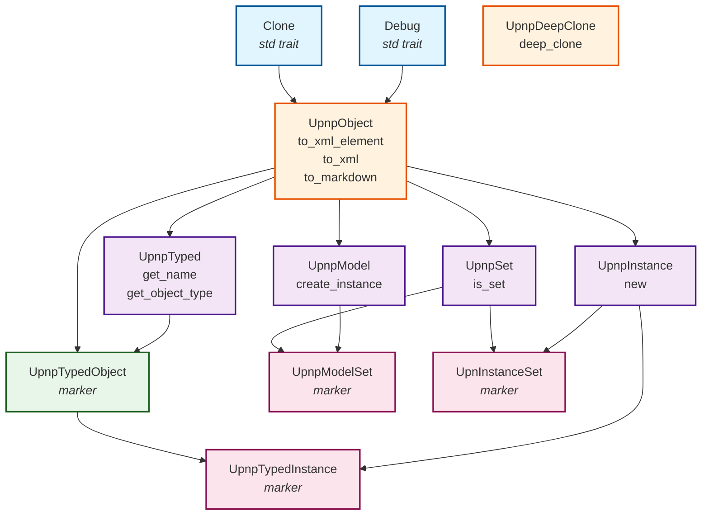

```mermaid
graph TB
    Clone[Clone<br/><i>std trait</i>]:::stdTrait
    Debug[Debug<br/><i>std trait</i>]:::stdTrait
    
    UpnpDeepClone[UpnpDeepClone<br/>deep_clone]:::baseTrait
    
    UpnpObject[UpnpObject<br/>to_xml_element<br/>to_xml<br/>to_markdown]:::baseTrait
    
    UpnpModel[UpnpModel<br/>create_instance]:::derived1
    UpnpInstance[UpnpInstance<br/>new]:::derived1
    UpnpTyped[UpnpTyped<br/>get_name<br/>get_object_type]:::derived1
    UpnpSet[UpnpSet<br/>is_set]:::derived1
    
    UpnpTypedObject[UpnpTypedObject<br/><i>marker</i>]:::derived2
    
    UpnpTypedInstance[UpnpTypedInstance<br/><i>marker</i>]:::derived3
    UpnpModelSet[UpnpModelSet<br/><i>marker</i>]:::derived3
    UpnInstanceSet[UpnInstanceSet<br/><i>marker</i>]:::derived3
    
    Clone --> UpnpObject
    Debug --> UpnpObject
    
    UpnpObject --> UpnpModel
    UpnpObject --> UpnpInstance
    UpnpObject --> UpnpTyped
    UpnpObject --> UpnpSet
    
    UpnpObject --> UpnpTypedObject
    UpnpTyped --> UpnpTypedObject
    
    UpnpTypedObject --> UpnpTypedInstance
    UpnpInstance --> UpnpTypedInstance
    
    UpnpSet --> UpnpModelSet
    UpnpModel --> UpnpModelSet
    
    UpnpSet --> UpnInstanceSet
    UpnpInstance --> UpnInstanceSet
    
    classDef stdTrait fill:#e1f5ff,stroke:#01579b,stroke-width:2px
    classDef baseTrait fill:#fff3e0,stroke:#e65100,stroke-width:2px
    classDef derived1 fill:#f3e5f5,stroke:#4a148c,stroke-width:2px
    classDef derived2 fill:#e8f5e9,stroke:#1b5e20,stroke-width:2px
    classDef derived3 fill:#fce4ec,stroke:#880e4f,stroke-width:2px
```