Oui. Pour un serveur UPnP/HTTP, l’URL de chaque device et service doit être **stable, unique et hiérarchique**, tout en restant simple à mapper depuis l’IP du serveur. Voici un schéma raisonnable :

---

### 1. Base URL du serveur

```
http://192.168.0.138:1900/
```

---

### 2. Devices

Chaque device a un **ID unique** ou un **nom** et un chemin dédié.
Exemple :

```
/device/<device-type>/<device-id>/
```

Exemples concrets :

```
http://192.168.0.138:1900/device/MusicRenderer/1/
http://192.168.0.138:1900/device/LightController/1/
```

---

### 3. Services d’un device

Chaque device héberge un ou plusieurs services, accessibles sous son chemin :

```
/device/<device-type>/<device-id>/service/<service-type>/
```

Exemples :

```
http://192.168.0.138:1900/device/MusicRenderer/1/service/RenderingControl
http://192.168.0.138:1900/device/MusicRenderer/1/service/AVTransport
http://192.168.0.138:1900/device/LightController/1/service/OnOff
```

---

### 4. Points spécifiques (facultatif)

* **Description XML (device/service)** :

```
/device/<device-type>/<device-id>/desc.xml
/device/<device-type>/<device-id>/service/<service-type>.xml
```

* **Action SOAP endpoint** :

```
/device/<device-type>/<device-id>/service/<service-type>/control
```

* **Event subscription (GENA)** :

```
/device/<device-type>/<device-id>/service/<service-type>/eventSub
```

---

### 5. Exemple complet pour MusicRenderer

```
http://192.168.0.138:1900/device/MusicRenderer/1/
http://192.168.0.138:1900/device/MusicRenderer/1/desc.xml
http://192.168.0.138:1900/device/MusicRenderer/1/service/RenderingControl/control
http://192.168.0.138:1900/device/MusicRenderer/1/service/RenderingControl/eventSub
http://192.168.0.138:1900/device/MusicRenderer/1/service/AVTransport/control
http://192.168.0.138:1900/device/MusicRenderer/1/service/AVTransport/eventSub
```

---

✅ Avantages :

* Hierarchique → facile à mapper et maintenir.
* Unique → pas de collision entre devices/services.
* Compatible avec SSDP/UPnP → tu peux construire le `device description URL` et le `service control URL` facilement.

Voici un exemple de schéma hiérarchique en **Mermaid** pour ton serveur UPnP avec plusieurs devices et services :

```mermaid
flowchart TD
    Server["UPnP Server<br>http://192.168.0.138:1900"]

    Server --> MR["Device: MusicRenderer 1<br>http://192.168.0.138:1900/device/MusicRenderer/1/"]
    Server --> LC["Device: LightController 1<br>http://192.168.0.138:1900/device/LightController/1/"]

    %% MusicRenderer Services
    MR --> MR_DESC["Description XML<br>http://192.168.0.138:1900/device/MusicRenderer/1/desc.xml"]
    MR --> MR_RC["Service: RenderingControl"]
    MR --> MR_AV["Service: AVTransport"]

    MR_RC --> MR_RC_CONTROL["Control<br>http://192.168.0.138:1900/device/MusicRenderer/1/service/RenderingControl/control"]
    MR_RC --> MR_RC_EVENT["EventSub<br>http://192.168.0.138:1900/device/MusicRenderer/1/service/RenderingControl/eventSub"]

    MR_AV --> MR_AV_CONTROL["Control<br>http://192.168.0.138:1900/device/MusicRenderer/1/service/AVTransport/control"]
    MR_AV --> MR_AV_EVENT["EventSub<br>http://192.168.0.138:1900/device/MusicRenderer/1/service/AVTransport/eventSub"]

    %% LightController Services
    LC --> LC_DESC["Description XML<br>http://192.168.0.138:1900/device/LightController/1/desc.xml"]
    LC --> LC_ONOFF["Service: OnOff"]

    LC_ONOFF --> LC_ONOFF_CONTROL["Control<br>http://192.168.0.138:1900/device/LightController/1/service/OnOff/control"]
    LC_ONOFF --> LC_ONOFF_EVENT["EventSub<br>http://192.168.0.138:1900/device/LightController/1/service/OnOff/eventSub"]
```



---

### Explication

* `Server` → base URL du serveur.
* Chaque `Device` a son propre nœud et un fichier de description XML (`desc.xml`).
* Chaque `Service` a deux endpoints principaux :

  * `control` → pour les actions SOAP.
  * `eventSub` → pour les abonnements aux événements (GENA).

---

